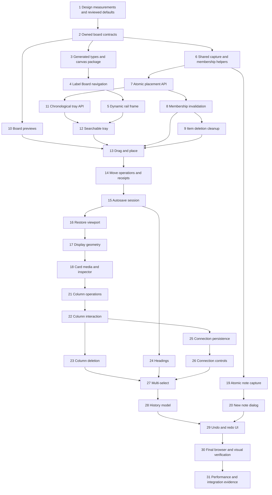

# Implementation Plan: Label board views

Status: **Feature implemented; Tasks 30–31 verification partially open.**
Spec: [SPEC-boards.md](../SPEC-boards.md). Tasks: [todo.md](todo.md).
The user invoked planning after reviewing the spec, authorizing this phase.
Proposed spec defaults are carried into this plan as recommendations, not silently
reclassified as confirmed interview decisions. Approving the plan resolves them.

The previous Reddit plan/checklist are preserved in
[archive/reddit-clipping-plan.md](archive/reddit-clipping-plan.md) and
[archive/reddit-clipping-todo.md](archive/reddit-clipping-todo.md), including 11
unchecked entries. Archiving does not complete their outstanding verification.

## Overview

Deliver one manually arranged board view per ordinary label, reached at
`/labels/$labelId?layout=board`. Start with an empty board, then deliver the full
find → drag → persist → reopen path before adding rich organization. Reuse the
existing owned library, automatic labeling, source/search/review rules, inspector,
theme, and app frames. Only notes can be created on boards in v1.

Use free `@xyflow/react` for the canvas. Application code owns board data,
ordered columns, history, and saving. Independent boards, virtual-label logic,
frames, nested boards, scraping, text editing/styling, export, touch editing,
collaboration, and offline editing remain deferred.

## Architecture decisions

### 1. Preserve the label route and select its frame dynamically

Labels currently live below the pathless `_app` route and always use `AppShell`;
`_rail` is a separate branch for `/boards` and `/graph`. Moving label Board view
to `/boards` would violate the agreed public route.

Keep the label route. Extend label-specific search validation with `board` while
Library/Inbox retain `list | grid`. Select the rail frame in `AppShell` only for
an actual label route with validated `layout=board`. Reuse existing `IconRail`
and frame primitives; avoid duplicate `<main>` elements, providers, or auth gates.
Allow LibraryView to render a label layout control without widening its item
renderer to an unsupported board layout. Existing independent-board placeholders
remain placeholders; do not introduce board CRUD navigation.

Board and list/grid use the same filter URL fields where meaningful. Tray scope,
sort, and optional All-library label filtering have separately validated state;
changing tray filters must not remove canvas placements or its selected inspector
item just because it no longer appears in the tray.

### 2. Store application data, not React Flow snapshots

Use the spec's `boards`, `boardElements`, and `boardConnections` with indexed,
owner-scoped lookups. Stable application element keys permit undo restoration
without depending on Convex document IDs or React Flow internals.

Use discriminated element validators in a small `boardValidators.ts`; map elements
to custom nodes at the frontend boundary. Item text/media stay in the library;
persist only references, geometry, modes, column order, and organizational text.
Columns own ordered children; headings and connections remain board-only.

All create/assign/place operations are atomic. Board metadata creation is lazy
and idempotent. Enforce uniqueness inside transactions, not by assuming an index
is a uniqueness constraint. Define upper bounds for text, geometry, batched reads,
operation bytes, and documents during Task 2. Large actions must reject before
writing if they exceed safe atomic limits; never perform half a group action.

### 3. Acknowledge operations and detect stale revisions early

Use expected board layout revisions, serialized local operations, and operation
identities. Add a small indexed operation-receipt ledger as a proposed schema
detail to support ambiguous network retries: key by owner/board/session/sequence,
store the request fingerprint and acknowledgment, and reject key reuse with a
different payload. Define bounded receipt retention and cleanup; after retention
expires, stale requests must conflict rather than replay as new operations.
Document this additive schema detail in the spec before implementing it.

The client overlays pending edits on the last acknowledged layout. Reactive
updates cannot erase pending changes or acknowledge work that never committed.
Completed drags produce operations; pointer ticks stay local. Undo submits the
inverse board operation through the same pipeline.

Viewport updates are independent of layout history/revisions and persist after
a 500ms debounce. Saving/Saved/Couldn't save describe actual acknowledgment.
Failed writes retain pending work and stop dependent operations. Conflicts retain
the local draft and require an explicit Reload latest choice. No collaborative
merge or durable offline queue is introduced.

### 4. Read complete layouts without unbounded documents or torn pages

Page elements/connections with indexed bounded reads. Include a layout revision
on every response; assemble only pages belonging to a coherent revision. If
reactive pagination changes that revision mid-load, resynchronize instead of
presenting a mixed layout. Disable mutations until the initial layout is complete.
Honor page-splitting metadata and byte/row bounds; requested page size is not a
promise that reactive results always contain that exact count.

Previews need a dedicated board projection: current library previews omit image
assets and contain only 160 original-input characters. Fetch a bounded title/body
excerpt, first attached image/poster URL, source, and label facts for placed IDs.
Resolve stored asset URLs server-side and keep full-content fetches inside the
existing inspector. Larger cards still use bounded previews in v1; resizing does
not download complete saved documents for every card.

### 5. Keep tray chronology correct without a mandatory link backfill

The existing label index ends in link creation time, so it does not implement
newest saved item ordering. Recommend a board-specific tray API:

- Browse the existing owner/item chronological indexes in ascending/descending
  order, with available source/review index narrowing.
- For the single current/selected label, look up membership for each bounded
  candidate page using the existing owner/item/label pair index. Filter that page
  without changing the source continuation cursor. In current-label Needs review,
  verify that link's unsure state rather than just the item's global review flag.
- Return fewer or zero matches with `isDone=false` when a sparse page warrants it.
  The client offers Load more and may fetch a small bounded number of additional
  pages to fill the visible tray; it must not label an empty intermediate page
  “No results” or fetch until exhaustion automatically.
- Search reuses owner/label full-text indexes and relevance ordering. Any chosen
  All-library label filter uses that label's search scope. Expose Best match during
  search; clear the query to restore Newest/Oldest.

Convex permits transforming/filtering the returned page while retaining cursor
metadata ([pagination documentation](https://docs.convex.dev/database/pagination)).
This approach avoids a required data backfill and preserves global chronological
order among returned matches. The tradeoff is extra pages for sparse labels;
measure it at the core-path checkpoint. If unacceptable, propose an indexed
item-created-time projection/backfill as a separate reviewed change rather than
quietly sorting loaded pages or migrating existing data.

### 6. Maintain membership across every writer

Extract existing capture and membership logic into shared transaction helpers,
retaining capture dedupe, counters, search projections, labeling scheduling, and
manual/model attribution rules. Use those helpers from board place/create
operations; never invoke a public mutation from another mutation.

Wire invalidation into manual label removal and existing item deletion. Current
`decisions.complete` only adds missing links and respects existing manual decisions;
it does not remove memberships today. Add regression coverage for that behavior
and require any future removal writer to use the same cleanup helper.

Removing membership must immediately make its old placement irrecoverable through
read or history, even if the label is re-added before asynchronous cleanup. Use a
placement membership generation or an equivalent transactional invalidation marker
to distinguish a new inclusion from the removed one. Reject stale writes and
hide invalid references while indexed bounded cleanup removes elements/connections.
Deletion of an item likewise hides its cards immediately and cleans all boards
without losing the existing history/label cleanup continuation.

### 7. Geometry, columns, and history remain pure domain logic

Use persisted image/text region heights and per-placement display modes. Recommended
defaults are 300px width, 200px image, 120px text, 160px minimum width, and 80px
minimum visible region height. Resizing combined cards scales regions proportionally;
switching modes preserves region geometry. Missing media does not create a huge
blank region or change default text-area height.

Columns determine child width and vertical order; ordinary detach restores remembered
free-standing dimensions. Removing only a column preserves current canvas positions,
displayed dimensions, and connections, as the explicitly provisional v1 rule.
Group moves deduplicate columns and selected children. Keep pure layout/history
tests separate from React Flow callbacks and backend mutations.

## Dependency graph and execution order

The numbered checklist in `todo.md` is the default order. Additional dependencies
are recorded per task there. Every three tasks have a verification checkpoint;
Task 31 is the final completion gate. No implementation starts until plan review.

### Working slices

1. **Tasks 1–6:** inspect design, define owned contracts, mount the real empty
   label Board view, preserve existing list/grid behavior and library writers.
2. **Tasks 7–15:** deliver safe placement/removal lifecycle, correct tray browsing,
   real previews, drag/drop, move, and acknowledged autosave. Test one item from
   find to placement to reopen before adding richer controls.
3. **Tasks 16–24:** viewport, card sizing/media/inspector, note creation, columns,
   and headings. Each feature is persisted and usable before the next.
4. **Tasks 25–29:** connections, group actions, and board-only undo/redo.
5. **Tasks 30–31:** certify design fidelity, failure/conflict behavior, real browser
   interaction, lifecycle invariants, and measured small-board performance.

## Verification strategy

Use focused Vitest tests for pure layout, history, session sequencing, and component
controls; `convex-test` for ownership, retries, atomicity, cleanup, and counters.
Real browser checks certify drag/drop, resizers, endpoints, frame changes, and
trackpad behavior; jsdom alone does not certify canvas geometry. This follows the
[React Flow testing guidance](https://reactflow.dev/learn/advanced-use/testing).

Task commands run from the repo root. At checkpoints, run backend/web suites,
workspace typechecks, and the web build. Final integration uses `pnpm check`.
Codegen or development pushes first require classifying the actual selected
deployment under the existing deployment guard; use the established development
deployment without creating/rebinding a project. Production is outside this plan.

Use the shared T3 preview browser when available, opening it before concluding
it is unavailable. Record actual environment and authenticated versus mocked
transport. Checkpoint reviews evaluate concrete working results; they are not
requests to reauthorize routine actions already approved by the implementation
request. A scope change or weakened acceptance target still requires review.

No repository-wide Definition of Done file was found at the planning skill's
referenced path. Use the spec's boundaries/success criteria and this explicit bar:
focused tests, relevant typechecks/build, credible browser evidence for interaction,
no known regressions, and accurately recorded limitations. Do not invent a missing
coverage percentage or substitute mocked results for required authenticated checks.

## Risks and mitigations

| Risk                                                       | Impact | Mitigation / early task                                                                                                                                                        |
| ---------------------------------------------------------- | ------ | ------------------------------------------------------------------------------------------------------------------------------------------------------------------------------ |
| Wrong ordering from label-link time                        | High   | Bounded item-index pagination with membership checks; test an old item assigned today in Task 11.                                                                              |
| Sparse labels require many tray pages                      | Medium | Empty-intermediate-page state and bounded autofill; measure at core checkpoint; review projection alternative if needed.                                                       |
| Shared writer refactor changes capture/count/AI behavior   | High   | Preserve existing tests before adding board calls; regression gate after Task 6.                                                                                               |
| Removed then re-added membership revives a stale placement | High   | Generation/invalidation contract in Task 8, with remove/re-add before cleanup test.                                                                                            |
| Stale snapshot/ambiguous retry duplicates or loses work    | High   | Revision/receipt contract in Tasks 2, 7, 14–15; test two owner sessions and lost acknowledgments.                                                                              |
| Paginated layouts combine incompatible revisions           | High   | Coherent revision assembly and resync in Task 2, verified again with multiple pages.                                                                                           |
| Current previews lack media and useful excerpts            | Medium | Dedicated bounded projection in Task 10; retain full-content inspector.                                                                                                        |
| Column coordinates/history drift                           | High   | Pure geometry tests, stable keys, whole-operation undo, real zoomed browser checks.                                                                                            |
| Layout operations grow beyond atomic write limits          | Medium | Payload/read bounds and early all-or-nothing rejection; no partial group actions.                                                                                              |
| Generated files push a task beyond five files              | Medium | Reserve generation as its own task; split any task that exceeds five files, including generated outputs.                                                                       |
| Design only exists in ignored export                       | Medium | Tracked visual measurements/reference notes in Task 1; never commit bundled export/assets.                                                                                     |
| Full-store subscriptions make dragging lag                 | Medium | Stable node definitions/callbacks, narrow selectors; measure before considering optimizations per [React Flow guidance](https://reactflow.dev/learn/advanced-use/performance). |

## Parallelization opportunities

Default execution is sequential. After contracts stabilize, media components and
pure geometry/history tests could be developed separately; tray and note-dialog
UI could also be isolated behind finalized APIs. Shared schema, generated types,
membership writers, receipt/session state, and final integration remain sequential.
No agents are spawned by this planning task. Parallel implementation requires
explicit coordination of file ownership and dependencies, not simultaneous edits
to `boards.ts`, `BoardView.tsx`, or generated APIs.

## Decisions for plan review

- Accept the spec's proposed geometry, first-image crop, fixed heading style,
  arrow/connection defaults, 100-action session history, and 25–200% zoom.
- Accept Best match during search and Newest/Oldest browsing; globally chronological
  full-text search is not included in this implementation plan.
- Accept the bounded chronological candidate-page approach for label browsing,
  subject to the core-path performance checkpoint rather than a silent backfill.
- Accept operation receipts and membership-generation/invalidation bookkeeping
  as necessary technical details; update the spec before coding them.
- Use the proposed 100-card / 10-column / 100-connection fixture and 33ms
  95th-percentile frame target on a recorded desktop. 500 cards is future work.
- Preserve provisional column deletion in v1; revisit only through a later
  explicit spec revision.

Approving this plan approves its technical choices and task order. It does not
deploy code or declare the outstanding archived Reddit verification complete.
