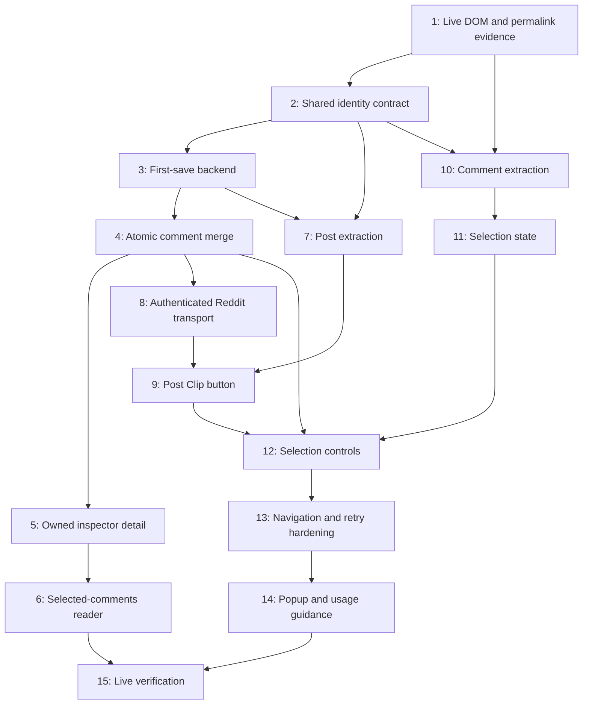

# Implementation Plan: Reddit post clipping with selected comments

## Current revision: individual comment Clip buttons (2026-10-09)

Status: planned, awaiting review; no product code changed in this planning turn.
Tasks 16–18 in [todo.md](todo.md) are the active revision. The original plan below
records the checkbox implementation; this revision supersedes its selection UI
and retry behavior. Existing completion evidence and pending manual X checks are
preserved.

### Intent and proposed behavior

Replace each eligible loaded comment's **Keep comment** checkbox with a native
**Clip** button in that comment's own action row. Clicking immediately saves that
comment; there is no selection step or subsequent post-button click. Parent and
reply buttons each capture only their own comment text.

Keep one Library item per owner/post. A first comment clip saves the containing
post plus that comment; later comment clips append to the same item. This is the
proposed interpretation of separate buttons, preserving the existing storage and
inspector model. The post Clip button sends no comments in feed or detail views.
Remove the selected-count and 20-comments-per-save guidance from the interface.

Each comment independently shows **Clip → Clipping… → Clipped**. Suppress repeat
clicks while that comment is pending and keep its successful button disabled for
the current post visit. Other comments and the post button remain usable. A new
visit starts with Clip because the extension does not fetch saved-comment state;
backend deduplication makes a repeat safe. Failed actions show actionable feedback
and remain retryable; transient errors reset after three seconds without losing
the retry payload. Size errors say “This capture is too large to save,” replacing
the instruction to deselect comments.

### Architecture decisions

- Reuse `buildRedditClip(post, [comment])`, the `clip-reddit` message, and
  `items.clipReddit`. The existing mutation already creates a post with comments,
  merges comment IDs atomically, and returns `addedCommentCount`. Zero additions
  still count as success. No schema, backend, inspector, generated API, or
  deployment changes are needed.
- Introduce a small `redditCommentClips.ts` state module keyed by the active
  post/navigation generation and comment ID. It owns pending requests, immutable
  snapshot retries, and session success state. Replace the bulk-selection store
  once the new path is connected. Keep post saves independent of comment saves.
- Resolve the active detail post from the current route and readable DOM, then
  reparse and validate the comment on activation. A first save requires readable
  containing-post data. Retry uses the frozen original post/comment payload after
  verifying the control still belongs to the active post and comment. Never save
  ancestor text, descendants, or another post's comments.
- Persist pending/retry/success state through same-post node and action-row
  replacement, including temporary detail-rendering gaps. Reset it on navigation
  to a different post, leaving detail, or content-script invalidation. Late replies
  cannot change a new navigation generation's controls, even after returning to
  the same post.
- Keep the watcher as the lifecycle owner and reuse its DOM observation. Comment
  controls own their listeners and feedback timers. Reconcile action-row parent
  identity as well as node/comment identity, avoid observer loops from our own
  button changes, and release all controls/listeners/timers on cleanup.
- Use native keyboard-accessible buttons, an accessible name such as “Clip comment
  to MindSpool,” visible focus, and a polite status announcement. Stop event
  propagation so clicking never toggles the Reddit thread or another native action.
  Preserve existing authentication and network guidance.

### Ordered task index and dependencies

1. **Task 16:** deliver immediate per-comment saves with independent state and
   lifecycle-safe controls; make post saves post-only.
2. **Task 17:** remove the obsolete selection modules and verify the complete
   extension regression suite.
3. **Task 18:** update the product spec and record new live interaction evidence.

Dependency chain: existing extraction/transport/atomic merge → Task 16 → Task 17
→ implementation checkpoint → Task 18 → completion checkpoint. Execute
sequentially because these tasks share watcher behavior. Each task anticipates at
most five files; split any repair that exceeds that scope.

### Verification and risks

Focused commands, acceptance criteria, and checkpoints are in `todo.md`. Verify
one immediate request containing exactly the clicked comment, independent pending
saves, duplicate suppression, immutable retries, same-route replacements, route
changes, keyboard activation, and complete cleanup. Run extension typechecking,
the extension regression suite, Firefox and Chromium builds, and existing backend
capture tests. These checks use workspace commands directly; no Turbo change is
planned.

Record real Reddit interaction and persistence evidence separately from fixtures.
Use the T3 collaborative preview if it can exercise the extension; do not describe
a page-only or mocked browser result as an authenticated Firefox save. If a live
extension browser is unavailable, state the gap explicitly. Existing real-tweet X
verification remains a separate pending check rather than being marked complete.

| Risk                                                        | Mitigation                                                                                                                      |
| ----------------------------------------------------------- | ------------------------------------------------------------------------------------------------------------------------------- |
| Concurrent comment/post clicks lose data                    | Keep independent requests; reuse atomic backend merging; run its existing regression tests and inspect a real two-comment save. |
| A stale or recycled node clips the wrong comment            | Revalidate route, post/comment identity, and own-node extraction before sending; test changed identities and late replies.      |
| Re-rendering creates duplicate requests or loses retry data | Store request state outside DOM nodes, reconcile replacement controls, and preserve immutable retry snapshots.                  |
| Button updates trigger observer loops or leak timers        | Retain extension mutation filtering and assert cleanup and idle reconciliation in integration tests.                            |
| Historical docs appear to describe the new interaction      | Update the spec in Task 18 and append dated verification evidence; label the earlier checkbox evidence as historical.           |

### Review assumption

Each button saves immediately into the containing post's existing Library item.
Separate standalone comment items would require a different data model and are
not included in this revision. Review this plan before implementation.

## Original implementation plan (historical)

Status: local implementation, automated verification, and review repairs complete,
2026-10-08. Live Firefox compatibility and component checks pass. Development
deployment/codegen and authenticated acceptance remain pending authorization.
See [the verification report](../docs/verification/reddit-clipping.md).
Spec: [SPEC-reddit-clipping.md](../SPEC-reddit-clipping.md).
Task checklist: [todo.md](todo.md). No previous active plan or checklist existed; archived plans remain untouched.

## Overview

Extend the Firefox clipper so a user can save a Reddit post, select loaded comments on its detail page, and later add more comments to the same Library item. Keep captured post/comment snapshots and labels unchanged once saved. Reuse Clerk authentication, Convex persistence, Reddit branding/filtering, and existing labeling/search rules. Deliver post capture before wiring comment selection; every intermediate step must leave existing applications working.

Invoking planning after the spec review is treated as approval to enter this phase. The proposed 20-comment selection limit, optional storage shape, and interaction details are included here for plan review. No product capability was added beyond the post-plus-selected-comments capture.

## Dependency graph



The numbered order in `todo.md` is the default execution order. Tasks 2-3, 4-6, 7-9, 10-12, and 13-15 form checkpoint groups, with a feasibility checkpoint after Task 1.

## Architecture decisions

### 1. Establish compatibility before implementation

Task 1 inspects real current Reddit in Firefox: card/compact feeds, main post detail, nested comments, crossposts, gallery/video/spoiler boundaries, dynamically loaded comments, and in-site navigation. Record selectors and any open-shadow-root requirements from actual DOM. Confirm the same post/comment can be identified across views and that an accessible insertion point exists. Do not invent selectors from web retrieval or remembered Reddit markup.

Candidate identity-only URLs are `https://www.reddit.com/comments/<postId>/` and `https://www.reddit.com/comments/<postId>/_/<commentId>/`. Verify both in Firefox, including opening the intended comment. These remove dependence on title slug and optional subreddit metadata. If those routes fail, establish one consistently derived alternative for all supported views before Task 2; never switch URL formats based on which metadata happens to be available. Update the spec's preferred subreddit URL to the verified strategy at this checkpoint.

A compatibility failure is a checkpoint finding: revise the contract or scope before dependent work. Closed roots must not be bypassed through page scripts or private state. Browser access is not available as a callable DevTools tool in this planning session; live compatibility remains an explicit first task.

### 2. Shared domain contract, authoritative backend validation

Add pure Reddit identity types/helpers/constants in `packages/schema/src/reddit.ts`, exported from its existing index. No DOM, Clerk, or Convex runtime dependency in this module. Test the shared helpers through the extension's existing Vitest runner; the schema workspace has no test script, and adding a runner is unnecessary.

Use lowercase base-36 post/comment IDs, stripping `t3_`/`t1_` when extracting fullnames. Set a conservative maximum of 32 characters per normalized ID. Domain helpers provide canonical post/comment URLs, `reddit:<postId>`, selection limit 20, and deterministic plain-text rendering of post plus comment snapshots. Require complete ID matches; reject malformed or mismatching identities.

The extension derives the API argument type from `FunctionArgs<typeof api.items.clipReddit>`. Convex `v` validators define the external shape; business validation checks IDs, ownership association, URL schemes, lengths, and limits at the mutation boundary. Domain types must remain structurally compatible with inferred validators, verified by TypeScript and contract tests.

### 3. Add one optional item field

Add `redditCapture` to `itemFields` in `packages/backend/convex/validators.ts`:

```ts
type RedditCapture = {
  postId: string;
  postText: string;
  outboundUrl?: string;
  comments: Array<{
    commentId: string;
    postId: string;
    permalink: string;
    author?: string;
    text: string;
    capturedAt: number;
  }>;
};
```

`capturedAt` is server time when that snapshot is first persisted. Existing `sourceMetadata` and `imageAssets` retain the first post metadata/media snapshot. `postText` retains the body independently of comments, so merges never have to parse a rendered string. Keep `extractedText` as a derived plain-text projection containing post text/link and selected comment authors, text, and permalinks. This supplies current search and AI consumers without changing their interfaces.

The schema imports `itemFields`, so adding its optional field changes the schema without requiring a new table or index. Legacy items remain valid. Comments disappear with the item through the existing removal path. List previews never include this potentially large field; owned detail includes it.

Bound the complete rendered `extractedText` to 100,000 characters after every merge. Validate title/author/site/description and images using the existing bounds. Comment author is at most 300 characters; comment links are generated by the backend, not accepted as arbitrary URLs. Outbound links are HTTP(S) URLs without credentials and within the existing 8,192-character URL bound. Each request contains at most 20 comments, but later requests may bring the saved total above 20. Never silently remove or truncate saved comments.

Because structured text and its projection coexist, add a conservative 900 KiB serialized UTF-8 size ceiling for the projected next item, with room for database metadata; verify the size calculation against installed Convex tooling before adopting it. This is an additional proposed validation guard, subject to plan review, rather than a new nominal comment-count limit. A size failure returns an actionable invalid result and writes nothing. Convex imposes document/value bounds; see [its data type documentation](https://docs.convex.dev/database/types).

### 4. Dedicated `items.clipReddit` mutation

Keep the endpoint in the existing `items.ts` module so generated API types continue to expose it through the current backend package export. Extract the existing insertion/statistics/initial-labeling flow into a private helper in that same file; `items.create` calls the helper with behavior unchanged. Pure Reddit validation/merge orchestration helpers live in `redditCaptureModel.ts`.

Proposed request and return contract:

```ts
type ClipRedditArgs = {
  post: {
    id: string;
    title: string;
    author?: string;
    subreddit?: string;
    text: string;
    outboundUrl?: string;
    images: string[];
  };
  comments: Array<{
    id: string;
    postId: string;
    author?: string;
    text: string;
  }>;
};

type ClipRedditResult = {
  itemId: Id<"items">;
  addedCommentCount: number;
};
```

Require `requireOwner(ctx)`; never accept owner ID from the extension. Derive URL, key, input type, capture source, site name, and comment URLs on the backend. Check each comment's declared post ID against the requested post. This validates consistency of client-captured data, not independent verification against Reddit; no Reddit API request is introduced.

Algorithm, entirely inside one mutation:

1. Validate the request and look up `(ownerId, reddit:<postId>)` through `by_owner_capture_key`.
2. If absent, validate the full prospective item, persist post plus unique comments in selection order, update owner totals, and start existing best-effort initial labeling. Refresh item state. Return the new ID and number of unique comments saved.
3. If present, enforce the established URL, input type, capture source, and post identity. Derive the union from the current database value and incoming comment IDs, keeping existing snapshots and appending only unknown IDs. Concurrent additions append in transaction commit order; one request preserves its own selection order.
4. If the union is unchanged, return the existing ID with `addedCommentCount: 0`; do not write or start AI.
5. Validate the combined size before writes. Patch only Reddit capture state, derived text, and `updatedAt`; call `refreshItemState` for searchable text/state. Keep metadata, original URL/input, post/media snapshot, creation time, labels, and manual decisions. Return the existing ID and actual addition count; start no new AI run.

An existing matching extension item without `redditCapture` can acquire comments: retain its existing extracted text as its first post text, initialize structured state only when adding something, and preserve metadata/media. Reject unrelated capture-key collisions. A manually saved Reddit URL with a different capture key remains a separate capture; do not introduce URL-wide deduplication or a migration.

This is an explicit additive save API: changed text for an already saved comment ID is ignored by design. The existing `items.create` conflict/replay contract is unchanged. Network timeouts may leave an already committed save; retrying the same post/comments is safe.

One Convex mutation provides atomic writes, and conflicts are retried by the platform's OCC mechanism. The owner/key lookup and current comment union must happen inside that transaction; `.unique()` is not itself a database uniqueness constraint. See [mutation transactions](https://docs.convex.dev/functions/mutation-functions) and [OCC/atomicity](https://docs.convex.dev/database/advanced/occ). Test merge rules with convex-test and separately exercise overlapping saves against an authorized development deployment; local tests alone do not prove production OCC behavior.

### 5. Extend the background transport additively

Retain `{ type: "clip", args: ClipArgs }` for X and add `{ type: "clip-reddit", args: ClipRedditArgs }`. The background dispatches the latter to `items.clipReddit` with the existing Clerk token provider and Convex client. Keep sender-ID validation and runtime message validation; no page-world listener or external messaging.

Existing responses stay compatible. Reddit success may include `addedCommentCount`. Failures keep `signed_out`, `invalid`, `network`, and `unknown`; add an optional invalid hint `content_too_large` for Reddit so the UI can say “Selection too large; deselect comments and try again.” The backend emits a bounded machine code for this hint; never return exception text, content, or tokens. Key conflicts remain a failure and must not be converted to success.

### 6. Capture controls and selection state

Use independent Reddit extractors, not the `Tweet` type or X-specific selectors/image normalization. A post parser returns only its outer post; a comment parser returns only that comment's own body, excluding descendants. Eligible images are references from available, revealed outer-post media. Titles alone suffice; unknown video/gallery formats degrade to title/text/link.

Keep a post-scoped ordered map of selected comment snapshots in `redditSelection.ts`. Snapshot a comment when selected, preserving that snapshot if its node disappears. A parent and reply are independent entries. Selecting nothing makes a valid post-only request. Enforce the 20-per-click limit before changing state, retaining the ability to deselect. Selection never makes network requests.

Inject native checkboxes labeled “Keep comment” only in the active post detail context. Show the selected count next to the post Clip button. Resolve identities from current DOM on interaction; a recycled node cannot retain a previous post's capture closure. Preserve selections through re-renders of the same post, but clear them when leaving it, closing its detail view, or navigating to another post.

Freeze the request/selection while saving. Success clears only the selection belonging to that request's post/navigation generation. Failure retains it for retry. Late replies after navigation must not clear another post's selection or set feedback on its controls. Retry a failed/unknown result with the same snapshot payload; no new capture key.

Use scoped, batched DOM observation, including identity-attribute changes if the evidence requires them. Ignore extension-owned control mutations to avoid observer loops. Register cleanup through the WXT content-script context: disconnect observers, remove handlers, and clear timers. Observe accessible roots only; do not instrument private page state or patch Reddit internals.

### 7. Structured inspector display, existing search/AI behavior

Expose `redditCapture` only through the owned `items.detail` projection and existing document access. `InspectorPreview` uses a small `RedditCapturePreview` component when structured data exists; otherwise retain its generic path. Show post body/outbound link once, existing images, then selected comments with author, text, and safe source links. Do not show both structured comment blocks and the flattened `extractedText` copy.

Keep full-library search capped at its existing 8,000 characters and label-scoped search at its current narrower metadata/input projection. New comment text participates only where it falls within these bounds. Existing `refreshItemState` maintains source/filter/counter facts and bounded link fan-out; do not write those fields independently.

Initial AI sees the current projection subject to its 500-character overall budget. Comment additions start no automatic paid run. The existing inspector Classify action remains available if the user wants to classify again; this plan does not alter its policy or input ordering. An initial pending run may finish after comments are added; preserve the existing decision lifecycle and assert merge does not create another run.

## Task list

The checklist in `todo.md` is authoritative; this is its ordered index.

| Phase             | Tasks                                                          | Observable checkpoint                                                       |
| ----------------- | -------------------------------------------------------------- | --------------------------------------------------------------------------- |
| Compatibility     | 1. Inspect live Reddit                                         | DOM and permalink strategy established                                      |
| Capture contract  | 2. Shared identity; 3. First-save backend                      | One owned Reddit item can be created without disrupting existing captures   |
| Saved discussion  | 4. Atomic merging; 5. Detail projection; 6. Inspector reader   | Selected snapshots persist, merge, and display correctly                    |
| Post clipping     | 7. Post extraction; 8. Transport; 9. Post button               | A real post clips from Firefox into the Library                             |
| Comment selection | 10. Comment extraction; 11. Selection state; 12. Controls      | Explicit selections clip together, with later additions to the same item    |
| Reliability       | 13. Lifecycle hardening; 14. Popup/docs; 15. Live verification | Error, navigation, ownership, concurrency, and regression evidence complete |

Every implementation task touches at most five anticipated files and has at most three acceptance bullets. If generated artifacts or actual DOM findings expand a task beyond that, split it rather than silently enlarging it. Schema/API changes are reviewed before enabling extension callers.

## Verification checkpoints and commands

Focused task commands are in `todo.md`. At each checkpoint, run affected suites and typechecks; builds are required when content scripts, manifests, or web components change. The final automated matrix is:

```sh
pnpm --filter @mindspool/schema typecheck
pnpm --filter @mindspool/backend test
pnpm --filter @mindspool/backend typecheck
pnpm --filter @mindspool/extension test
pnpm --filter @mindspool/extension typecheck
pnpm --filter @mindspool/extension build:firefox
pnpm --filter @mindspool/extension build
pnpm --filter @mindspool/web test
pnpm --filter @mindspool/web typecheck
pnpm --filter @mindspool/web build
pnpm exec prettier --check SPEC-reddit-clipping.md tasks/plan.md tasks/todo.md
```

Use the installed formatter on changed source files too. No Turbo configuration/command change is planned. The planning skill's referenced `.agents/references/definition-of-done.md` is absent; use the spec's success criteria and these explicit checks, rather than inventing a standing contract.

Before any development push, codegen, or live mutations, identify and announce the actual target under [convex-deploy-guard](../.agents/skills/convex-deploy-guard/SKILL.md). Use the existing development deployment after authorization; do not create/rebind an anonymous deployment. Once authorized for that target, the existing commands are:

```sh
pnpm --filter @mindspool/backend exec convex dev --once
pnpm --filter @mindspool/backend codegen
```

Never hand-edit generated definitions. Count changed generated files in task sizing; split a regeneration follow-up if needed. No deploy, codegen, API mutation, installation, or runtime tests are executed in this planning turn. Development deployment approval is separate from plan approval under the spec's existing boundary; production deployment and extension publishing are outside this work.

## Risks and mitigations

| Risk                                                | Impact | Mitigation                                                                                                            |
| --------------------------------------------------- | ------ | --------------------------------------------------------------------------------------------------------------------- |
| Reddit layouts/root boundaries differ               | High   | Live compatibility task first; test fixtures per view; explicit scope revision if an insertion target is inaccessible |
| Slug/subreddit/comment paths change identity        | High   | One shared verified URL strategy; backend derives canonical URLs; cross-view repeat tests                             |
| Nested replies or crossposts contaminate extraction | High   | Own-node boundaries and exact payload tests; independently select each comment                                        |
| Concurrent saves lose comments or create duplicates | High   | Read/union/write in one mutation; semantic tests plus overlapping saves against dev                                   |
| Projection duplicates large stored text             | Medium | Combined text and prospective item byte bounds; no partial merges                                                     |
| Re-renders/navigation retain stale selections       | High   | Post/generation-scoped state; current-DOM identity on click; ignore stale async completions                           |
| New API/schema breaks existing clients              | High   | Optional fields, new mutation/message discriminator, unchanged create behavior and legacy fixtures                    |
| Comments are saved but outside search/AI windows    | Medium | Retain existing budgets explicitly; test short searchable fixtures; no claim of full-thread AI/search coverage        |
| External media expires or is absent                 | Low    | Save references only; readable title/text persist; no archival guarantee                                              |

## Parallelization opportunities

After Task 2 establishes the contract, post parsing (7) and comment parsing (10) can proceed independently of backend implementation. After Task 5, web reader work (6) can proceed independently of extension UI (9-12). Tests/docs may proceed on settled contracts. Shared schema/API changes, transport wiring, selection integration, and final deployment/live verification must be sequential or coordinated. This plan identifies opportunities; no agents are dispatched in the planning turn.

## Open decisions for review

1. Approve the optional `redditCapture` field and new `items.clipReddit` mutation, including conservative stored-size validation and server-stamped snapshot receipt times.
2. Approve checkbox selection with a count and 20 comments per save; later saves can add more.
3. Keep first snapshots/labels and run AI automatically only on first save, as drafted in the spec.
4. Live URL and DOM evidence must settle the candidate routes/insertion points in Task 1. This is an implementation feasibility gate, not an unresolved product choice to fill in silently.

After review, execute the task checklist incrementally. Approval of planning artifacts does not mean those tasks are already implemented or verified.
