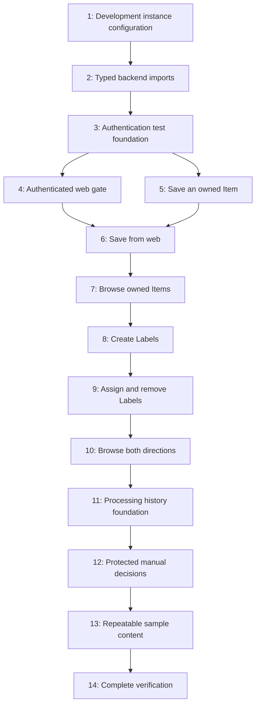

# Implementation Plan: Authenticated Library Foundation

Status: approved by the user; implementation in progress.

## Overview

Build the first usable path: sign in, save an Item, assign several Labels, and
open either a Label to see its Items or an Item to see its Labels. Establish the
Processing Run and sample-content foundations for later decision experiments.

Requirements come from [README.md](../README.md), the user's clarification that
Labels serve as collections, and [CAPABILITIES.md](../CAPABILITIES.md). This plan
follows the user's explicit request for planning against those requirements;
separate module specifications have not yet been written or approved. Proposed
design choices below are part of this review, not settled implementation facts.

Tasks and verification checkpoints are tracked in [todo.md](todo.md). No existing
`tasks/plan.md` or `tasks/todo.md` was present when this plan was created.

## Existing Foundation

- Web, mobile, extension, shared packages, and root checks already exist.
- Clerk UI is wired; the web entrypoint supports `ConvexProviderWithClerk`.
- Convex JWT configuration exists, but the database schema is empty.
- There are no data functions, generated backend definitions, or tests yet.
- Local Clerk/Convex configuration is absent. Live verification needs development
  instances; mocked authentication is a separate check.

## Scope

This increment implements the web path and a reusable Convex backend. Existing
mobile and extension shells must continue to compile. It prepares image asset
references and processing records, without implementing extraction or AI calls.

Search, content deduplication across independent captures, export, full deletion
workflows, mobile/extension capture, boards, and graphs remain later roadmap work.
They are not prerequisites for verifying this setup increment.

## Architecture Decisions for Review

### Identity

- Clerk remains the identity provider. Use the verified Convex identity's
  `tokenIdentifier` as `ownerId`; clients never submit an owner. No user-profile
  table or Clerk webhook synchronization is needed for this increment.
- Every public read and write requires authentication. Lookups by document id
  verify ownership; relationship writes verify both endpoints share that owner.
- Unknown and foreign document ids receive the same not-found response. Anonymous
  access receives an authentication error. Tests cover all public functions.
- Mount data components only after Convex authentication is ready, using its auth
  state rather than only Clerk's sign-in state. Keep setup, loading, signed-out,
  authentication-failure, and signed-in states understandable.

### Data Model

| Entity           | Responsibility                                                             | Important access paths                                       |
| ---------------- | -------------------------------------------------------------------------- | ------------------------------------------------------------ |
| `items`          | Original save, capture source, optional URLs/metadata/content/assets/state | Owner's newest Items; owner-authorized Item detail           |
| `labels`         | User-owned name and normalized lookup name                                 | Owner's Labels; owner plus normalized name                   |
| `itemLabels`     | Item–Label membership and manual decisions                                 | Owner plus Item; owner plus Label; owner plus Item and Label |
| `processingRuns` | Recorded enrichment/decision attempt, status, suggestions, measurements    | Owner plus Item; owner-authorized Run detail                 |

- Labels have a many-to-many relationship with Items. There is no Collection
  entity. Introduce tables with the vertical slice that first uses them.
- Preserve original input verbatim. A URL save accepts HTTP/HTTPS; a text save
  accepts nonblank text. Keep original and canonical URLs distinct. Capture
  succeeds independently of enrichment; no extractor is scheduled in this phase.
- Proposed starting limits: 8,192 characters for a URL, 100,000 for original text,
  and 80 for a Label name. Reject oversized input explicitly. Source metadata,
  extracted content, asset-reference lists, and result payloads get bounded
  validators before their write paths are introduced.
- Keep uploaded asset ids separate from external image references. Stored assets
  use Convex storage ids, with URLs resolved on read. This phase does not upload,
  download, or validate remote image content.
- Proposed label-name rule: trim outer whitespace, reject blank names, and reuse
  an existing Label for a case-insensitive name match within the same owner.
  Preserve a display name. Different owners can use the same names.
- Attaching a Label is idempotent. Removing membership is also idempotent and
  leaves both the Item and Label intact. Preserve manual removal decisions so a
  later processing result cannot silently reattach a rejected Label.
- Processing Runs store suggestions separately from manual decisions. Provider,
  model, modality, rubric/question version, confidence, latency, and cost are
  optional where an attempt does not supply them. Do not invent measurements.

### APIs and Queries

- Use object-form Convex functions with argument and return validators. Keep
  worker-facing writes internal; expose only functions used by the application.
- Suggested public boundaries: `items.create/list/get`, `labels.create/list`,
  `itemLabels.attach/remove/listForItem/listItemsForLabel`, and an owner-scoped
  processing-history query. Final names are checked against installed SDK types.
- Use indexes for owner scoping and relationship lookup. Paginate lists; do not
  collect entire growing tables. Label-page pagination follows membership rows
  and returns the related owned Items without requiring a second database.
- Retry protection for a single save uses a stable client-generated capture key
  checked within the same mutation. Separate deliberate captures can create
  separate Items; cross-capture content deduplication comes later.
- Export generated API types from the backend package. Apps use a declared
  workspace dependency rather than reaching across app directories.
- Keep platform-independent vocabulary in `packages/schema`; infer Convex
  documents and ids from its generated data model rather than maintaining a
  second handwritten copy of every database document type.

### Reproducible Setup and Tests

- Select a persistent Convex development deployment and one Clerk development
  instance before API generation. Convex 1.46.0's installed `codegen` command
  loads selected deployment credentials; do not assume it works offline.
- Keep generated Convex API/server/data-model definitions in version control.
  Ignore them for formatting; regenerate when backend contracts change. This
  allows clean-clone checks without Clerk or deployment secrets.
- Local bootstrap exception: the pinned CLI's `codegen --system-udfs --typecheck
disable` path was inspected and exercised. It calls the local SDK templates
  without selecting or pushing a deployment. Use it only to bootstrap/test this
  component-free backend while instance setup is pending; normal development
  generation remains `pnpm --filter @mindspool/backend codegen`. This hidden flag
  is version-specific and must be reassessed before a Convex upgrade.
- Add Vitest, `convex-test`, and the recommended Edge Runtime test environment to
  the backend. Resolve compatible versions at implementation time and lock them
  through pnpm. Use mocked identities for deterministic ownership tests.
- Add backend tests to the existing `pnpm check` path, which CI already invokes.
  Avoid a separate CI pipeline when the existing one can enforce the same bar.
- Each task targets at most five handwritten files. Generated definitions and
  pnpm's lockfile updates are mechanical outputs identified separately where
  applicable; they do not justify broadening a task's behavioral scope.

## Dependency Graph



Task 3 prepares local tests, and Task 4 gates the UI, before any library component
mounts. Tasks 5–7 deliver save/retrieval. Tasks 8–10 deliver Label navigation.
Tasks 11–13 prepare later experiments. Execute sequentially in the shared
workspace; no parallel agents are required.

## Ordered Task Index

| Phase               | Tasks | Result                                                    |
| ------------------- | ----- | --------------------------------------------------------- |
| Identity foundation | 1–3   | Selected dev instances, typed imports, tested identity    |
| First save          | 4–6   | Authenticated web user can preserve an original save      |
| Library membership  | 7–9   | Owned Item browsing and multiple Labels per Item          |
| Label navigation    | 10–12 | Both navigation directions and protected manual decisions |
| Experiment setup    | 13–14 | Repeatable examples and recorded end-to-end verification  |

Every phase ends with a checkpoint in `todo.md`. Review checkpoints before
continuing; do not mark one complete using compiler output alone when it requires
a running application.

## Verification Commands

Existing commands:

```sh
pnpm typecheck
pnpm build
pnpm check
pnpm --filter @mindspool/extension build:firefox
pnpm dev:web
pnpm dev:backend
```

Configuration/generation, after selecting the intended development deployment:

```sh
pnpm --filter @mindspool/backend setup
pnpm --filter @mindspool/backend codegen
```

Proposed test commands, introduced in Task 3:

```sh
pnpm --filter @mindspool/backend test
pnpm --filter @mindspool/backend test -- convex/auth.test.ts
```

The backend `test` script will run `vitest run`; task-specific filters follow the
same form. Task 3 adds that suite to `pnpm check`. Tests use mocked backend
identities; browser checks additionally verify Clerk-issued tokens and a running
development deployment.

## Risks and Mitigations

| Risk                                           | Impact | Mitigation                                                                                     |
| ---------------------------------------------- | ------ | ---------------------------------------------------------------------------------------------- |
| Clerk/Convex instances are not configured      | High   | Resolve deployment selection early; distinguish mocked tests from live verification.           |
| Cross-user access through ids or relationships | High   | Derive owner server-side; test foreign ids, mixed-owner links, and all list paths.             |
| Generated types fail in a clean clone          | High   | Check in generated outputs; verify normal checks without deployment credentials.               |
| Clerk is signed in before Convex is ready      | Medium | Gate data components with Convex auth state; test loading and rejected-token behavior.         |
| Duplicate or slow relationship lookups         | Medium | Indexed, transactional membership writes; paginate each growing list and test page boundaries. |
| Reprocessing reverses a manual removal         | High   | Persist explicit manual decisions; test later suggestions against both additions and removals. |
| Setup grows into the whole roadmap             | Medium | Finish the minimal save/Label flow; defer search, capture integrations, and model calls.       |

## Review Points and External Inputs

- Confirm the proposed private-workspace scope and label-name matching rule.
- Select the intended Clerk instance and Convex **development** project. No
  production deployment or new external account creation is included.
- Confirm original URL/text saving with retry protection is sufficient for this
  increment; independent-save deduplication remains later work.
- Confirm the proposed starting input limits. Choose a small starting label
  vocabulary before the sample-content task. Sample fixtures must be identified
  as examples; do not invent real user saves or expected model accuracy.

No application or deployment changes are authorized by this planning artifact
alone. Review the plan before beginning implementation. Instance secrets stay in
ignored local files or the provider's environment, never in these documents.

## Source Checks

- [Convex with Clerk](https://docs.convex.dev/auth/clerk): verifies the distinction
  between Clerk sign-in and authenticated Convex requests.
- [Convex testing](https://docs.convex.dev/testing/convex-test): documents in-memory
  function tests, mocked identities, and Edge Runtime test configuration.
- [Convex pagination](https://docs.convex.dev/database/pagination): documents
  paginated query results and client integration.
- Installed `packages/backend/node_modules/convex/src/cli/codegen.ts`: confirms
  selected-deployment requirements and the recommendation to check in generated
  definitions for Convex 1.46.0.
